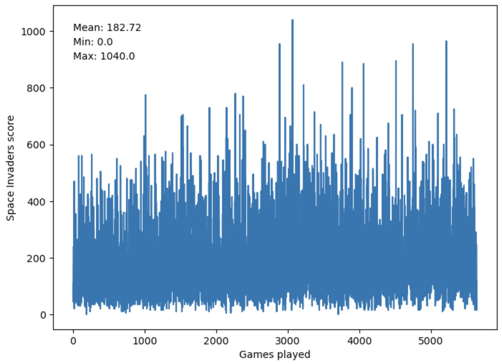
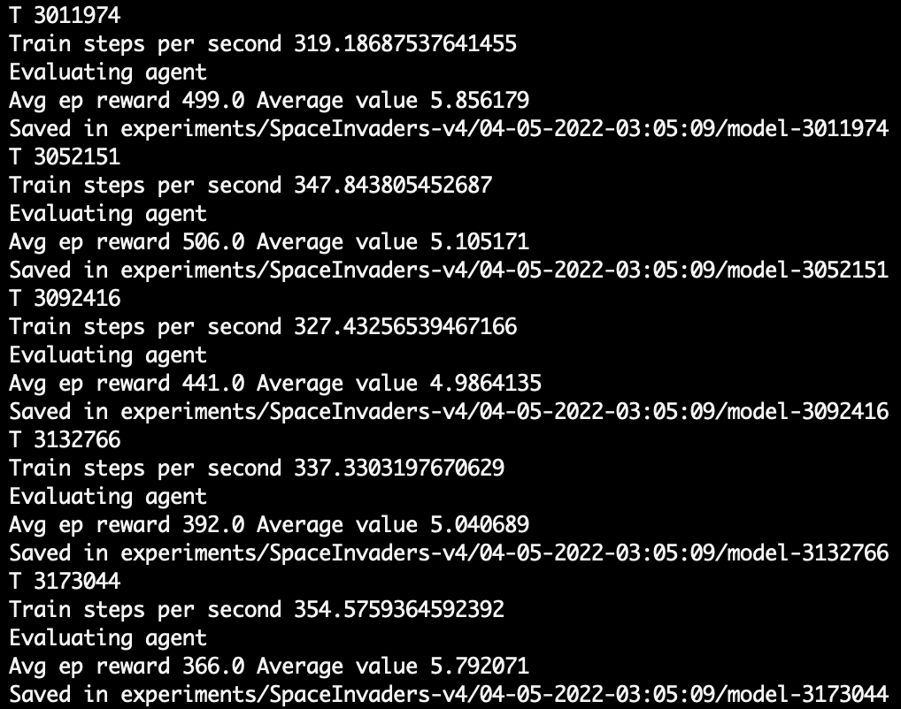

# Solving Space Invaders with RL

# Environment

In this project, I aimed to tackle the game of Space Invaders with Reinforcement Learning. The game is quite famous but just for the recap: we have a spaceship at the bottom of the screen and a dozen of aliens approaching it. The aliens are shooting at the spaceship but. the spaceship can dodge and shoot back. The aim of the game is to eliminate as many aliens as possible without dying. The game is infinite, meaning that, as long as the gamer does not lose all of their lives, the game can keep on going forever.

There are 6 actions available to the agent at each step: ['NOOP', 'FIRE', 'RIGHT', 'LEFT', 'RIGHTFIRE', 'LEFTFIR]. NOOP means “no operation.” The state space is of shape (210, 160, 3).

# Preprocessing

The original image input shape is (210, 160, 3), with a 128 color palette. This means, that at input, we have $210*160*3=100,800$ variables. This is problematic due to the computational power limitations. In one of the first, more famous attempts at solving the Space Invaders problem, Andrej Karpathy (then @Stanford, now AI @Tesla), came up with a downsampling method that makes the problem much more tractable. First, he saw that the top 26 rows display the score, which does not have any valuable information for the AI agent learning the game. We can thus crop the top of the image. Second, he acknowledged that the colors don’t really play the role in the game. Because of that, we can convert the images to the greyscale representation, thus reducing the third dimension to a single scalar between 0 and 1. Afterwards, he downsamples to 84x84 pixels, leaving us with $84*84=7,065$ variables at input.

Next, we need to observe that for the Atari games, such as Space Invaders, there is a need to capture the temporal flow of the environment. A picture of the given state does not capture all the information that our agent needs to learn; we need to understand in which direction the aliens are moving and how fast their bullets are moving in our direction to correctly estimate what is the best action to take at any given state. Because of that, we need to concatenate a couple of input frames together. In the DQN implementation, I concatenate 4 of them, leaving us with the final input to the Neural Network of size $84*84*4=28,224$.

# Methodology

In the first attempt to solve the Space Invaders, I used the default Deep Q-Learning Network algorithm (with a couple of tricks to improve the learning process). To better understand this method, let me take a step back and describe a more naive approach, Q-Learning.

## Q-Learning

When aiming to solve a Reinforcement Learning problem, we usually have an agent which takes actions in a certain environment, and our goal is to teach the agent, which actions it needs to take at any given observed state of the environment to achieve its goal. At each step, our agent observes a state $S$ and takes an action $A$, which takes it to the next state, $S'$. Each action that an agent takes in a given state is quantified with a reward - a numerical value which describes how ‘good’ the given action is in that state. In traditional Q-learning, we use a so-called Q Table to store each pair of $(A, S)$ with an associated reward. Given that the reward is usually delayed (e.g. a bullet shot at time step 1 hits the alien at time step 3, upon which the reward is given. The cause of receiving this reward is, however, the shot taken at TS=1), we need to account for this temporal difference when calculating the reward. To achieve it, we use the Bellman equation with a discount factor. This Q Table is our policy - a decision-making function that takes in a pair of $(A, S)$ and outputs the expected reward. At each time-step, our agent chooses the action that, given the current $S$, yields the best reward.

The problem with the regular Q-Learning is that maintaining the Q-Table gets intractable in more complex environments. The core innovation that Deep Learning proposes in the reinforcement learning area is the idea that we can express the Q-Table as a Deep Neural Network. The most basic algorithm that uses this idea is the Deep Q Network, developed by Google’s DeepMind.

## DQN

As already stated, in DQN, we use a Neural Network to approximate the Q-function. The process of learning such a model entails finding the parameters of a NN (weights and biases), such that an agent choosing the best actions based on the output of the NN maximizes its long-term performance (maximizes the long-term reward). In greater detail, the Deep Q-network is trained by obtaining the target estimate for Q-values and by minimizing the loss function, which is measured as the squared error of the target Q value and prediction Q value. Now, the way in which we define the loss function in reinforcement learning might seem a bit confusing at first (at least for me it was). Because of that, I will aim to explain it below.

In supervised ML, we are usually given the set of input values and the associated labels. In a categorical classification setup, this could be a set of X values representing pixels of input images, and the Y values (0s and 1s) representing whether the images represent cats or dogs. In RL, we do not have the label values directly representing the rewards we can expect from the given actions that an agent can take. Because of that, we need to find a way to approximate this reward function and train our agent such that, upon observing a given state, the reward associated with the best action approximates all the future rewards that the agent can expect from taking this action and following its learned policy until the termination state. This expected reward is represented by the Q-function. Our loss can thus be defined as the difference between the (sum of rewards we obtain by following the optimal policy, starting at state $s_{t+1}$ and taking the action $a_{t+1}$ until the $t$ of the termination state) and the (Q-value from taking an action $a_t$ when in state $s_t$). The first part of this pseudo-equation represents the Bellman equation and is based on the following intuition: if the optimal value $Q^*(s', a')$ of the sequence $s'$ at the next time-step was known for all possible actions $a'$, then the optimal strategy is to select the action $a'$, maximizing the expected value of $r+\gamma Q^*(s',a')$:

$$
Q^*(s',a')=\mathbb{E}_{s'\sim \epsilon}[r+\gamma max_{a'}Q^*(s',a')|(s',a')]

$$

where $r$ represents the immediate reward from taking the action $a'$ and $\epsilon$ represents the discount factor. The higher the discount factor, the more weight we put on the future rewards. In practice, we use a neural network to approximate our action-value function. We can, thus, calculate our loss function using the following equation:

$$
L_i = \mathbb{E}_{s, a \sim p(\cdot )}[(y_i-Q^*(s,a;\theta_i))^2],
$$

where $y_i = \mathbb{E}_{s'\sim \epsilon}[r+\gamma max_{a'}Q^*(s',a';\theta _{i-1})|(s,a)]$ is the target for iteration $i$ and $p(s,a)$ is a probability distribution over sequences $s$ and actions $a$. Based on the above formulation, we can see that the targets depend on the network weights and are not fixed, as is in the case of supervised learning. The loss function is differentiable and thus we can apply the gradient optimization techniques to it.

Now that we have the basic intuition, there are a couple of notable caveats that need to be mentioned.

First, let us tackle the exploration-exploitation trade-off in reinforcement learning and how I approached it in this project. When beginning to train our agent in a new environment, we want it to explore the state space as much as possible. This is done by the agent taking random steps. Such exploration leads the agent to encounter a lot of different problems from which it can learn which actions yield desirable outcomes. As the training progresses in time, we believe that the agent gets ‘smarter’ thanks to its exploration of the state space, and we can trust it more to make the informed decisions based on its learnings rather than randomization. This is what we call exploitation in RL; using the best action available to the agent based on its reward function. To achieve a good balance between exploration and exploitation, I used the epsilon-greedy action selection mechanism. At each step, the algorithm will take a random step (exploration) with $\epsilon$ probability and select the best action based on its Q-function with $1-\epsilon$  probability (exploitation). I start with the highest epsilon value possible, 1, and decrease it at each timestep by a small fraction until the value of 0.1 is achieved after 1,000,000 iterations. With such approach, we let the agent learn about the environment first, and use its acquired skills more with time.

Second, in their paper on applying DQNs to Atari environments, Minh et. al. (2013), have used a technique called experience replay. They store the agent’s experiences at each time-step,  pooled over many episodes into a replay memory. During the inner loop of the algorithm, they apply Q-learning updates, or minibatch updates, to samples of experience, drawn at random from the pool of stored samples. Thanks to this approach, they were able to re-use the same samples multiple times, thus improving the computational efficiency, and decrease the variance of the updates to the network’s weights by decreasing the samples’ correlation by introducing randomization. This technique is used in this project.

Third, in a vanilla DQN implementation, we use the same Q-network to compute the loss for every action during training and update the network’s weights. At every step of training, the Q-network’s values shift. Given that we are using a constantly shifting set of values to adjust our network values, the learning process can become unstable (e.g. by falling into feedback loops between the target and estimated Q-values). To tackle this problem, we introduce another network, called Q-Target network. It has the same architecture as the original Q network but its weights are separate. We use this new network to calculate the estimates of the reward function, and only update the original Q network at each step. The values of the original network are copied over to the Q-Target network every $N$ number of steps.

## A3C

A3C stands for Asynchronous Advantage Actor-Critic algorithm and is one of the state-of-the-art Reinforcement Learning algorithms (as of 2022). The key to understand this algorithm is to explore what each of its characteristics stands for.

### Asynchronous

In DQN, we used a single agent described by the neural network that interacted with a single environment. In A3C, we take advantage of multiple agents, with the hope that they will explore a larger part of the state space and together learn in a more robust way. The A3C architecture uses a global neural network with shared parameters, and a set of agents, each with a separate function approximator with its own weights and biases. The agents explore the state space independently and update the global network asynchronously after $N$ number of steps. After each update, the agents reset their parameters to those of the global network and continue their independent exploration and training for $N$ steps until they update themselves again. This approach enables us to train multiple agents in parallel, thus speeding up the learning process, and allows us to limit the problem with the sample correlation that multiple RL models suffer from. Given that, A3C no longer uses the experience replay to decorrelate the samples. What’s worth mentioning here is that the original A3C paper proposed two variations to the algorithm: one with agents using feedforward neural networks with convolution layers, and the second one with recurrent neural networks, LSTMs.

### Advantage

Advantage in Reinforcement Learning, in an intuitive way, answers the question of “how better the reward for an agent is (when taking a specific action) than it could be expected, given the current state?” It comes from the realization that the Q values can be decomposed into two pieces: the state Value function $V(s)$ and the advantage value $A(s,a)$:

$$
Q(s, a)=V(s)+A(s, a)=>A(s, a)=Q(s, a)-V(s)=>A(s, a)=r+ {\gamma} V\left(s_{-} \text {hat }\right)-V(s)Q(s,a)=V(s)+A(s,a)=>A(s,a)=Q(s,a)−V(s)=>A(s,a)=r+γV(s−hat )−V(s)
$$

Instead of optimizing our critic agent based on the Q-values, we make it learn the advantage function, which allows it to learn not only how good an action s but also how much better it can be. But... what is a critic?

### Actor-Critic

There are essentially two main families of RL algorithms (at least when bisected across this axis): Value-Based, and Policy-Based. The former aim to learn the approximation of the mapping between the actions and reward values. This approximation is a Q-function and maximizing it leads to achieving the desirable behavior of an agent. An example of a Value-Based RL algorithm is DQN. The latter class, Policy-Based algorithms, aim to optimize the behavior of an agent by learning the policy directly, without the use of Q-function. The actor-critic architecture aims to capture the advantages of these two approaches. It splits the model into two parts: the actor that ****finds the best action based on a state and the critic, which computes the Q values of that action. These two models work in tandem: the actor performs a certain action and the critic evaluates how good that action is. Gradient ascent is applied to both, which allows them to get better in their consecutive tasks. This, in turn, leads to an increased performance of the RL agent in the environment we are trying to solve.

### Evaluation

Our ultimate goal in this project is to create an agent that plays Space Invaders well. Given that, the best way to evaluate its performance would be to measure its average performance in the game. To achieve this, we measure the agent’s final reward achieved before it gets killed by the aliens. These values get stored as the training progresses, which allows us to visualize how the agent was improving over time. The agents trained are then compared to each other based on the average result achieved over 100 gameplays after the training was finalized. Additionally, I tried to play the Space Invaders myself to see what is the reasonable performance I should expect from my agents (I was playing this version: [https://www.free80sarcade.com/spaceinvaders.php](https://www.free80sarcade.com/spaceinvaders.php)). My score was usually around 700-1000, so any AI agent regularly achieving results around that or greater would be considered very good by me.

The DQN model achieved the result slightly above 200. Comparatively, A3C’s results were oscillating between 300 and 500, which shows an improvement over the more basic algorithm. While 500 is not a very impressive score, it shows the first signs of ‘intelligence’ of the agent. If the A3C model was ran for longer, it is likely that with the same hyperparameters, it would achieve an even better score, possibly beating my abilities. The training process of the DQN network and the last couple of logs from training the A3C are represented below:

DQN:

A3C:

# What I’ve learned

Essentially, the project constituted a good recap of basic RL concepts and a great deep dive into two algorithms: DQN and A3C. I had a basic understanding of RL coming into this project but most of my knowledge was very superficial. Thanks to working on this project, I learned more about the details of RL (such as how the loss function is calculated), and understood the aforementioned algorithms to a pretty good extent. It was also a good practice in coding. Both of the algorithms were based on other engineers’ implementations. However, they were using old versions of the frameworks (TF and Gym), which made the code incompatible with my setup. I needed to refactor certain things to get it to work, which was a nice practice session with the two frameworks mentioned. Additionally, since A3C runs by multithreading, I needed to learn a little bit about it, at least to understand what’s happening in the code.

# Next steps

- Experiment with different architectures, loss functions, and optimizers. In particular, I saw some projects claiming that Huber loss is better than MSE in this particular environment, and that Adam might converge quicker than RMSProp.
- Changing learning hyperparameters...
    - REPLAY_MEMORY = 40000 # number of previous transitions to remember
    - BATCH_SIZE = 32 - how many previous observations are used to train the network at each step
    - UPDATE_TIME = 10000 - reducing this number could decrease the training time at a risk of training getting (more) unstable
    - Epsilon - governing the discount factor
- ... or run Bayesian Optimization for hyperparameter tuning
- Implementing the LSTM architecture to A3C
- Improving the A3C script, including a better evaluation of the model, and the visualization of its gameplay
- Improve the write-up to include all the relevant citations. I was trying to rephrase everything in my own words but nonetheless, the attribution is important